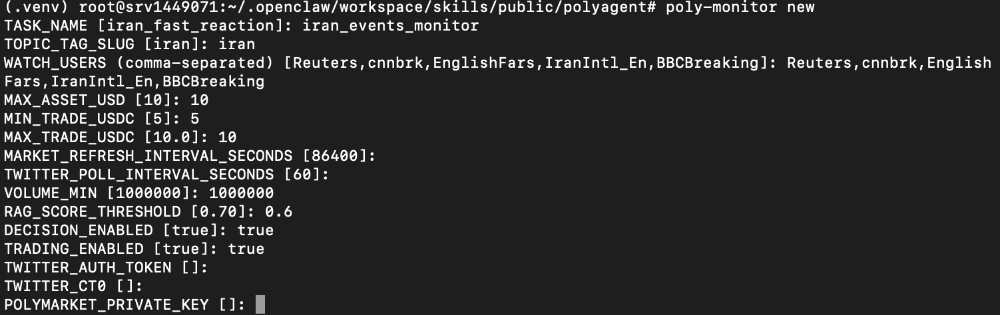
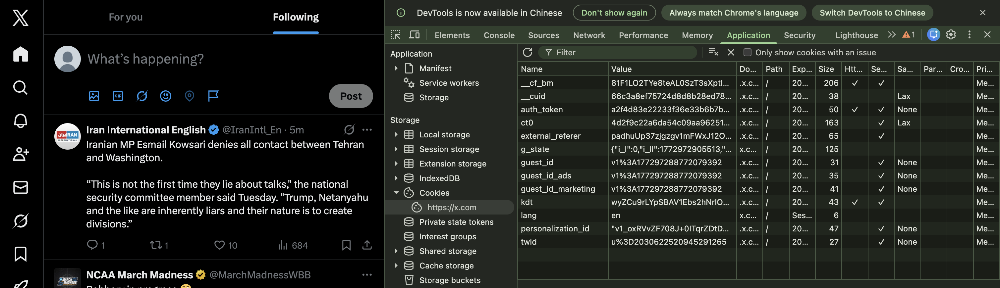
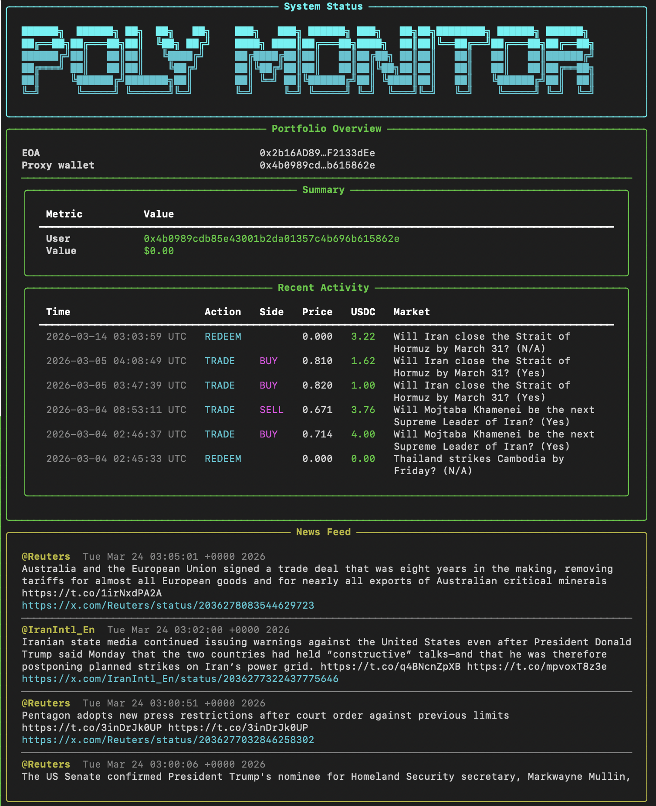

<div align="center">

# Poly Monitor（中文）

<pre>
██████╗  ██████╗ ██╗  ██╗   ██╗    ███╗   ███╗ ██████╗ ███╗   ██╗██╗████████╗ ██████╗ ██████╗
██╔══██╗██╔═══██╗██║  ╚██╗ ██╔╝    ████╗ ████║██╔═══██╗████╗  ██║██║╚══██╔══╝██╔═══██╗██╔══██╗
██████╔╝██║   ██║██║   ╚████╔╝     ██╔████╔██║██║   ██║██╔██╗ ██║██║   ██║   ██║   ██║██████╔╝
██╔═══╝ ██║   ██║██║    ╚██╔╝      ██║╚██╔╝██║██║   ██║██║╚██╗██║██║   ██║   ██║   ██║██╔══██╗
██║     ╚██████╔╝███████╗██║       ██║ ╚═╝ ██║╚██████╔╝██║ ╚████║██║   ██║   ╚██████╔╝██║  ██║
╚═╝      ╚═════╝ ╚══════╝╚═╝       ╚═╝     ╚═╝ ╚═════╝ ╚═╝  ╚═══╝╚═╝   ╚═╝    ╚═════╝ ╚═╝  ╚═╝
</pre>

> “Facts do not cease to exist because they are ignored.” — Aldous Huxley

[](https://pypi.org/project/polyagent/)
[](./LICENSE)
[]()

[English](./README.md) | [中文](./README.zh.md)

</div>

# PolyAgent（Polymonitor）
Polymonitor 是一个轻量级、完全本地化的 AI 交易代理框架，基于 Python 构建。它使用户能够监控实时信息、通过 RAG 匹配市场机会，并基于 Openclaw 执行自动化交易决策。
## 概述
```
PolyAgent 提供完整的端到端（7×24 小时）流水线：
Twitter 新闻流 & Polymarket 事件
        ↓
本地 RAG 匹配（MiniLM + FAISS）
        ↓
市场筛选
        ↓
OpenClaw 决策引擎
        ↓
本地钱包执行（Metamask）
        ↓
仪表盘监控
```
## 核心能力
*轻量级本地部署* 💻

+ 完全本地执行（无云端依赖）
+ 运行要求：
 + ~2GB 内存
 + 单核 CPU
 + 适用于低配服务器和个人设备

*市场数据管道* 📊

+ 根据关键词自动抓取 Polymarket 事件
+ 筛选活跃且可交易的市场
+ 基于 Polymarket API 构建本地结构化数据集

*基于 RAG 的市场匹配* 🔍

+ 使用轻量级 sentence-transformer:all-MiniLM-L6-v 模型嵌入 + FAISS 索引
+ 将市场转换至向量空间
+ 将实时新闻与相关市场进行匹配
+ 实现精准的阈值触发信号检测

*实时新闻监控* 🐦

+ 基于 twikit 通过配置的关注列表进行 Twitter 流式抓取
+ 低延迟轮询

*自主决策引擎* 🦞

+ 基于提示词驱动的 OpenClaw 代理推理
+ 自主判断：
  + 是否进行交易 /
  + 选择哪个市场 /
  + 买入 YES 还是 NO
+ 通过集成技能直接执行交易

## 快速开始（建议在 tmux 里运行）

为了长时间稳定运行，建议在 `tmux` 会话中执行：

```bash
sudo apt update
sudo apt install tmux -y
tmux
```

```bash
python3 -m venv .venv
source .venv/bin/activate
pip install --no-cache-dir "git+https://github.com/pothitos/twikit.git@patch-1"
pip install -e .
poly-monitor new
poly-monitor run --task <task_name>   # 测试模式：前台打印完整输出
poly-monitor start --task <task_name> # 实战模式：后台 worker + 终端仪表板
```

> PyPI 上的 `twikit` 版本在此场景不稳定，需先安装 GitHub `patch-1` 版本。

> 建议将 `poly-monitor start --task xxx` 及相关操作都放在 tmux 中，避免会话中断。

## 配置步骤说明



- 从浏览器 cookie/控制台复制 Twitter 的 `auth_token` 和 `ct0`，即可连接账号，无需页面登录。
- 配置你要监控的账号（通常需要你本身已关注这些账号）。
- 本地填写钱包私钥（MetaMask / Phantom / Coinbase 等，推荐 MetaMask），建议先使用小额测试钱包。
- Poly-monitor 本地运行，不需要把钱包凭据上传到仓库。
- 你也可以直接修改 `tasks/<task_name>/task_config.py` 里的 `WATCH_USERS`。



执行 `poly-monitor start --task <your task name>` 会启动后台 worker 与仪表板。



## 下单

运行 `clawhub install polymarket-minimal-buy-python`，可直接从 ClawHub 安装该技能以启用下单能力（我们也会持续更新这个技能）。然后在安装后的 skill 文件夹中配置私钥。或者，你也可以直接让 OpenClaw 为你编写下单技能。

## 架构与用户指南（合并版）

### 运行主流程

1. `poly-monitor new` 创建任务配置（`tasks/<task>/task_config.py`）。
2. 市场管线从 Gamma API 拉取并筛选活跃市场。
3. RAG 使用真实市场问题构建向量；如果没有子 market，则回退到 event title。
4. Twitter 轮询监控账号。
5. 达到阈值后，合成决策 prompt 并发送给 OpenClaw。
6. 交易返回和匹配新闻写入任务日志。

### CLI 模式

- `run`：测试模式，前台持续打印输出。
- `start`：实战模式，后台启动 worker，并在终端显示每分钟刷新的仪表板。

### Start 模式仪表板

`start` 仪表板固定显示三个终端模块：

- 顶部状态栏：version、init time、当前 UTC 时间、heartbeat、transactions / triggered news 数量。
- 资产模块：EOA / Proxy Wallet、Portfolio Value Summary、Recent Activity、Open Positions。
- 滚动新闻模块：`tasks/<task>/data/tweets.jsonl` 最新内容。

仪表板和运行时私钥读取变量：`POLYMARKET_PRIVATE_KEY`。

### task_config.py 字段说明

- `TASK_NAME`：任务名。
- `MAX_ASSET_USD`：每次决策参考的最大资金上限。
- `MIN_TRADE_USDC` / `MAX_TRADE_USDC`：决策 prompt 中交易区间。
- `TASK_INIT_TIME`：初始化时间。
- `MARKET_REFRESH_INTERVAL_SECONDS`：市场数据与向量索引刷新周期。
- `TWITTER_POLL_INTERVAL_SECONDS`：Twitter 轮询周期。
- `WATCH_USERS`：监控账号列表。
- `TOPIC_TAG_SLUG`：Gamma API 主题 slug。
- `VOLUME_MIN`：市场筛选最小交易量阈值。
- `RAG_SCORE_THRESHOLD`：触发决策的阈值。
- `DECISION_ENABLED`：是否调用 OpenClaw。
- `TRADING_ENABLED`：prompt 上下文中是否允许下单动作。
- `OPENCLAW_COMMAND`：默认命令为 `['openclaw','agent','--message']`。
- `TRUSTED_MEDIA`：用于 prompt 构造的媒体上下文列表。
- `TWITTER_AUTH_TOKEN` / `TWITTER_CT0`：twikit 登录 cookie。

### 核心调用

```bash
openclaw agent --message "<decision prompt>"
```

### 关键日志

- `tasks/<task>/data/tweets.jsonl`：抓取到的推文。
- `tasks/<task>/logs/runtime_events.jsonl`：新闻、阈值触发、合成 prompt、交易返回。
- `tasks/<task>/logs/task_runtime.log`：后台 worker 运行日志。
- `tasks/<task>/test/decision_records.jsonl`：详细触发调试记录。

### 常用任务命令

```bash
poly-monitor list
poly-monitor stop --task <task_name>
```

## TODO

- [ ] 后续补充交互式 UI 版本。
- [ ] 扩展 Twitter 之外的信息源。
- [ ] 支持 `sell`、`split`、`merge`、`redeem`。
- [ ] 支持策略与限价单。

## License

MIT
